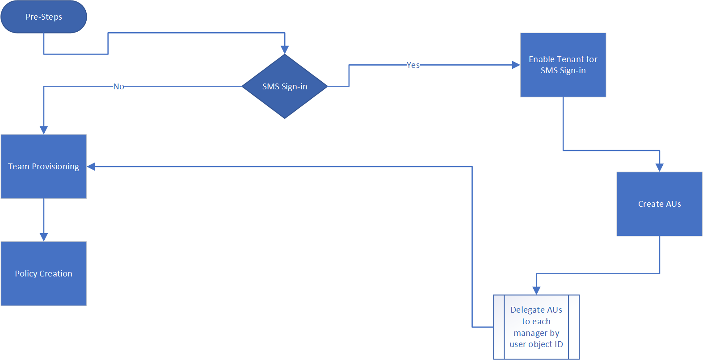
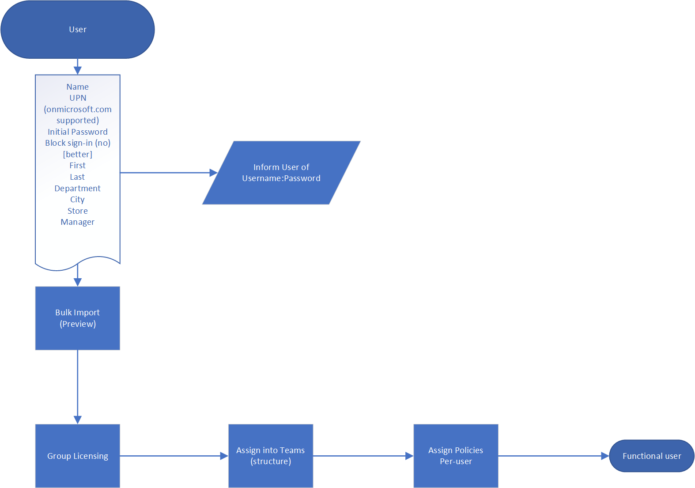
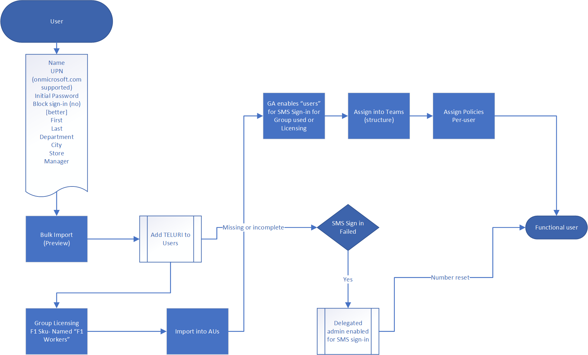

# Microsoft Teams - Firstline Worker Bulk Add

Tool to bulk add Teams, Team Channels, assign users to Teams, assign Teams policies to users

## Requirements

1. Must have accounts with the following roles: Global Admin, User Admin, Teams Service Admin
2. User has the rights to install and configure software on their local machine

## Process

### Configure the Local Environment

Setting the local environment variables enables the scripts to run using relative paths.  The rootPath is the root of where you cloned this repository, and the tenantName is in the form yourTenant.onmicrosoft.com (no https://).

1. Open a PowerShell session and navigate to the scripts folder inside the cloned git repo
2. Run the script .\SetConfig.ps1 -tenantName [your tenant name] -rootPath "full path to the root of the git repo"

For example: .\SetConfig.ps1 -tenantName contoso.onmicrosoft.com -rootPath "C:\data\source\FLWTeamsScale"

### Setup Credentials

    NOTE
    
    How credentials are managed in these scripts may not be appropriate for your use, and they are easily changed to meet your requirements.  
    Please follow your company standards and practices for securing service accounts and managed identities.

The scripts use credentials that are stored as XML files in $ENV:LOCALAPPDATA\keys, i.e. the AppData\Local folder.  The helper function Set-Creds in the module [BulkAddFunctions.psm1](./scripts/BulkAddFunctions.psm1) needs to be called to set the credentials used to run these scripts.  This technique removes the need for you to authenticate to all various service endpoints while maintaining the credentials in a local store.  From within each script, the appropriate credentials are read with the helper function Get-Creds and those credentials are used to connect to the various services.

When you call Set-Creds, you are prompted to provide a XML file name that will be written to $ENV:LOCALAPPDATA\keys.  You might have different credentials for different services.  For example you might have different credentials for MicrosoftTeams, AzureAD, and MSonline, in which case you can run Set-Creds saving each credential file with its own meanignful name.

Examples:

    Set-Creds msol-cred.xml
    Set-Creds azuread-cred.xml
    Set-Creds teams-cred.xml 

Run the script [SetCreds.ps1](./scripts/SetCreds.ps1) to save your credentials.  You will be prompted with "Performing the operation "Export-Clixml"..." and enter 'Y' to approve.  NOTE - the account used for the credentials cannot require MFA.

Here is an example of how the various scripts then use the saved creds to authenticate:

    # Connect to MicrosoftTeams
    $teams_cred = Get-Creds teams-cred.xml
    Connect-MicrosoftTeams -Credential $teams_cred

### Configure PowerShell Modules and Environment Variables

Before you start, the PowerShell environment needs appropriate modules and versions, and the environment variables need to be updated with your values (per above).  Follow the instructions at [Configure PowerShell Modules](./docs/ConfigurePowerShellModules.md)

### Create Teams

Create the Teams needed to support the Firstline workers.  For example, a Team may be created per location or store.  Follow the instructions at [Create Teams](./docs/CreateTeams.md)

### Create Channels for Teams

Create the Team Channels per team created in the previous step Create Teams.  Channels are used to segment common work areas within a Team.  Follow the instructions at [Create Teams Channels](./docs/CreateTeamsChannels.md)

### Create Teams Message Policies

Create the Team Message Policies.  Message Policies control what messaeg features are available to the assigned users.  Follow the instructions at [Create Teams Message Policy](./docs/CreateTeamsMessagePolicies.md)

### Create Users, Security Groups, and Assign Users to Security Groups

Create the users, security groups, and assign the Firstline user to their security group. Follow the instructions at [Create Users](./docs/CreateUsers.md)

### Assign Users to Teams

Assign the users to their assign Teams. Follow the instructions at [Assign Users to Teams](./docs/AssignUserstoTeams.md)

### Assign Policies to Users

Assign the Teams policies to users. Follow the instructions at [Assign Policies to Users](./docs/AssignPoliciestoUsers.md)

### Convert Group Membership Type

In [Convert Group Membership Type](./docs/ConvertGroupMembershipType.md), you will find instructions for migrating existing groups from assigned, or static, membership to dynamic membership.  Note running this script requires the tenant is licensed for Azure AD P1 or above.

### Verify User Login

The created user will have an initial password that is in the CreateUsers.ps1 and they are required to change it at their first login.  Test the user to ensure they have access to the appropriate Teams.  If Firstline employee provisioning is managed through your Identity and Access Management team, you will need to follow that process for providing the employee their credentials.

## Exceptions in Processing

Exceptions in processing are written to CSV files located in the LOGS folder of the root project; an exception is anything that was attempted to be created but it already existed in the target tenant.  These CSV files can be used to investigate any issues with the already existing items.

## Error Handling

Minimal error handling has been implemented apart from try/catch blocks and storing the error into a variable in the catch block.  Additional error handling must be implemented according to your preferences.

## Process Flows

### Pre-steps Flow

### Delegated Admin Flow

### Basic User Flow

### SMS Sign-in Flow

## Links

[New Team Channel (PowerShell)](https://docs.microsoft.com/en-us/powershell/module/teams/new-teamchannel?view=teams-ps)
[New Teams Messaging Policy (PowerShell)](https://docs.microsoft.com/en-us/powershell/module/skype/new-csteamsmessagingpolicy?view=skype-ps)
[Assign policies to your users in Microsoft Teams](https://docs.microsoft.com/en-us/microsoftteams/assign-policies#install-and-connect-to-the-microsoft-teams-powershell-module-1)
[Assign licenses to user accounts with Office 365 PowerShell](https://docs.microsoft.com/en-us/office365/enterprise/powershell/assign-licenses-to-user-accounts-with-office-365-powershell)

## Contributing

This project welcomes contributions and suggestions. Most contributions require you to agree to a Contributor License Agreement (CLA) declaring that you have the right to, and actually do, grant us the rights to use your contribution. For details, visit https://cla.microsoft.com.

When you submit a pull request, a CLA-bot will automatically determine whether you need to provide a CLA and decorate the PR appropriately (e.g., label, comment). Simply follow the instructions provided by the bot. You will only need to do this once across all repos using our CLA.

This project has adopted the [Microsoft Open Source Code of Conduct](https://opensource.microsoft.com/codeofconduct/). For more information see the [Code of Conduct FAQ](https://opensource.microsoft.com/codeofconduct/faq/) or contact opencode@microsoft.com with any additional questions or comments.
